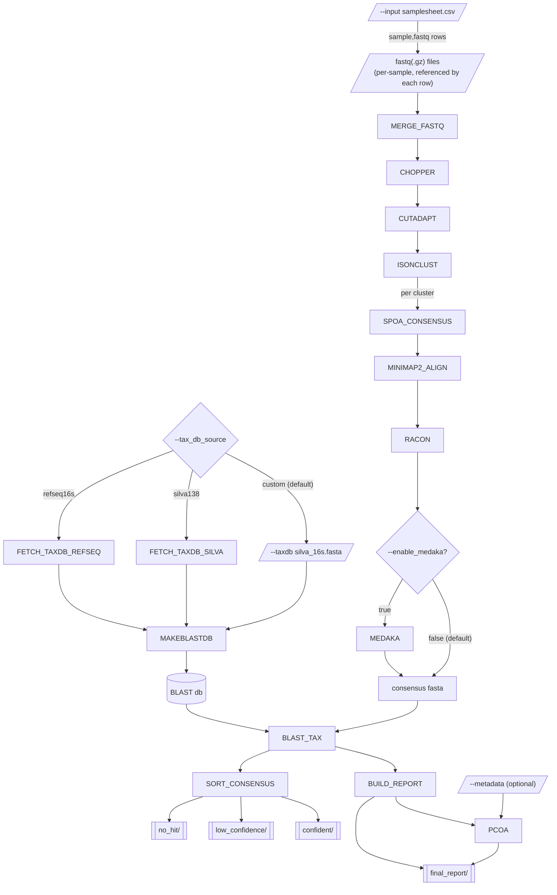

# 16S-nf

A Nextflow (DSL2) pipeline for classifying Oxford Nanopore 16S rRNA amplicon
data from microbial communities: quality-aware clustering (isONclust) +
spoa/racon/medaka consensus + reference/BLAST taxonomy assignment, plus
Bray-Curtis/PCoA beta diversity. Sibling pipeline to
[edna-ont-nf](https://github.com/ehill-iolani/edna-ont-nf) -- same
architecture, retargeted at 16S microbiome profiling instead of eDNA species
detection, and emitting the same `abundance_table.tsv` schema so the
iolani-bioinformatics frontend's abundance/rarefaction charts work against
either pipeline's output unmodified.

Loosely follows [wf-metagenomics](https://github.com/epi2me-labs/wf-metagenomics)'
stages (ingest -> filter -> classify -> abundance + diversity report), but
classifies via alignment against a targeted reference (wf-metagenomics'
"minimap2 mode", implemented here via BLAST) rather than Kraken2 -- a better
fit once noisy per-read ONT data has been consensus-polished, and it keeps
the reference a plain FASTA a non-specialist can swap out, same as
edna-ont-nf's `--taxdb`. wf-metagenomics computes alpha diversity/rarefaction
per sample but not beta diversity -- the PCoA step here fills that gap.

## Requirements

- [Nextflow](https://www.nextflow.io/) >= 23.10.0
- One of Docker, Singularity, or Conda (every process is containerized; pick
  a profile below)

## Quickstart

```bash
nextflow run main.nf \
  --input samplesheet.csv \
  --taxdb silva_16s.fasta \
  --fwd_primer AGAGTTTGATCMTGGCTCAG --rev_primer TACGGYTACCTTGTTACGACTT \
  -profile docker
```

`samplesheet.csv` is a two-column CSV:

```csv
sample,fastq
sample_a,data/barcode17/*.fastq.gz
sample_b,data/barcode18/*.fastq.gz
```

`fastq` may be a single file or a glob matching multiple part-files (they're
merged per sample before filtering). Glob paths resolve relative to the
launch directory, not the samplesheet's location.

`silva_16s.fasta` is a plain FASTA of 16S reference sequences (e.g. exported
from [SILVA](https://www.arb-silva.de/) or NCBI's 16S targeted-loci
database); a BLAST db is built from it at the start of every run.

Instead of supplying your own, `--tax_db_source` can auto-download a
reference for you:

```bash
nextflow run main.nf \
  --input samplesheet.csv \
  --tax_db_source silva138 \
  -profile docker
```

| `--tax_db_source` | Reference |
|---|---|
| `custom` (default) | Whatever FASTA `--taxdb` points to |
| `silva138` | SILVA 138.1 SSURef, restricted to Bacteria/Archaea, converted from RNA to DNA |
| `refseq16s` | NCBI RefSeq targeted-loci 16S export (Bacteria + Archaea) |

`silva138`/`refseq16s` need network access from wherever the pipeline runs,
and cache the downloaded fasta under `--tax_db_cache` (default
`assets/tax_db_cache/`) so it's fetched once and reused on later runs. When
`--tax_db_source` is anything other than `custom`, `--taxdb` is ignored (and
not required).

Optionally, `--metadata metadata.csv` (`sample,<any columns>`, e.g.
`sample,group,site`) gets joined onto the PCoA output for coloring points by
group/site/etc. in the frontend -- it has no effect on classification.

Dev/debug entry point to run just the merge step in isolation, e.g. while
iterating on a module:

```bash
nextflow run main.nf -entry MERGE_ONLY --input samplesheet.csv -profile docker
```

## Parameters

| Parameter | Default | Description |
|---|---|---|
| `--input` | *(required)* | Samplesheet CSV (`sample,fastq`) |
| `--tax_db_source` | `custom` | Reference database: `custom` (use `--taxdb`), `silva138`, or `refseq16s` (the latter two auto-download and cache) |
| `--taxdb` | *(required if `--tax_db_source custom`)* | 16S reference sequences FASTA; a BLAST db is built from this each run |
| `--tax_db_cache` | `assets/tax_db_cache` | Where auto-downloaded reference databases are cached between runs |
| `--outdir` | `results` | Output directory |
| `--fwd_primer` / `--rev_primer` | `null` | Primer sequences for cutadapt trimming; trimming is skipped if unset |
| `--min_len` / `--max_len` / `--min_qual` | `1200` / `1800` / `10` | chopper length/quality filtering thresholds -- sized for full-length 16S; narrow for a single V-region amplicon |
| `--cluster_id` | `0.86` | isONclust similarity threshold -- tune per amplicon/primer set |
| `--min_cluster` | `20` | Minimum reads in a cluster to attempt consensus |
| `--enable_medaka` | `false` | Use medaka-polished consensus instead of the racon consensus downstream |
| `--min_pident` | `90` | BLAST hits below this %identity are flagged `low_identity`, not dropped; also the cutoff for what counts as an identified taxon in the rarefaction curve and PCoA |
| `--metadata` | `null` | Optional CSV (`sample,<columns>`) joined onto the PCoA output for coloring |

All defaults live in `nextflow.config`, not `main.nf` (see the comments
there if you're adding a new one).

## Pipeline



1. `MAKEBLASTDB` -- build a BLAST db (once per run) from `--taxdb`, or from `FETCH_TAXDB_SILVA`/`FETCH_TAXDB_REFSEQ`'s output when `--tax_db_source` is `silva138`/`refseq16s`
2. `MERGE_FASTQ` -- merge multi-part fastq(.gz) files per sample
3. `CHOPPER` -- length/quality filter
4. `CUTADAPT` -- primer trimming (skipped if no primers supplied)
5. `ISONCLUST` -- quality-aware de novo clustering
6. `SPOA_CONSENSUS` -- draft consensus per cluster
7. `MINIMAP2_ALIGN` + `RACON` -- alignment-based polish
8. `MEDAKA` -- ONT-specific polish, opt-in via `--enable_medaka`
9. `BLAST_TAX` -- taxonomy assignment against the run's BLAST db
10. `BUILD_REPORT` -- per-run abundance table + QC summary html
11. `PCOA` -- Bray-Curtis distance + classical PCoA across samples, optionally joined with `--metadata`
12. `SORT_CONSENSUS` -- gather every consensus fasta by BLAST-hit confidence

Consensus fasta headers are stamped as
`>{sample}_{cluster_id} sample={sample} cluster_size={n_reads}` by whichever
of RACON/MEDAKA produces the final consensus for a cluster.

## Output layout

```
results/
  {sample}/
    00_merged/                merged fastq
    01_filtered/               chopper output
    02_trimmed/                 cutadapt output
    03_clusters/                isONclust clusters
    04_draft/{cluster_id}/      spoa draft consensus
    05_racon/{cluster_id}/      minimap2 alignment + racon consensus
    06_consensus/               medaka consensus (only if --enable_medaka)
    07_taxonomy/{cluster_id}/   BLAST hits per cluster
  blastdb/                     BLAST db built from --taxdb
  consensus_by_confidence/
    confident/                 best BLAST hit >= --min_pident
    low_confidence/            best BLAST hit < --min_pident
    no_hit/                    no BLAST hit at all
  final_report/
    abundance_table.tsv        one row per cluster: sample, cluster_size, best hit, tied_taxa (species tied for the best bitscore, if more than one), flag_reason
    run_qc_summary.html        cluster counts, per-sample flagged counts
    pcoa_coordinates.tsv       one row per sample: PC1-PC3 (+ % variance explained), plus any --metadata columns
  pipeline_info/                Nextflow timeline/report/trace
```

`abundance_table.tsv` is byte-for-byte the same schema edna-ont-nf produces
(`seq_id, sample, cluster_size, subject_id, pident, length, evalue,
bitscore, stitle, tied_taxa, flag_reason`) -- this is what lets the platform's existing
abundance and rarefaction charts work against 16S-nf's output with no
frontend changes. `pcoa_coordinates.tsv` is new to this pipeline (edna-ont-nf
doesn't compute beta diversity).

## Repo structure

```
main.nf                     entry point, samplesheet parsing, --help
workflows/16s.nf             subworkflow chaining all steps
modules/*.nf                one process per tool, one container each
bin/build_report.py         abundance table + QC html
bin/pcoa.py                 Bray-Curtis + classical PCoA, optional metadata join
nextflow.config              param defaults, profiles, resource labels
nextflow_schema.json         JSON Schema describing every --param (for UIs/validation tooling)
conf/test.config             -profile test overrides (small synthetic dataset)
assets/                      your own local samplesheet/taxdb/metadata go here (gitignored, except NO_METADATA)
assets/tax_db_cache/         auto-downloaded SILVA/RefSeq reference fasta, cached across runs (gitignored)
tests/data/                  small synthetic dataset used by -profile test
.github/workflows/ci.yml     runs -profile test on push/PR
```

## Testing

`tests/data/` holds a small synthetic dataset (two samples, a handful of
reads each -- the same fixtures edna-ont-nf uses for its own test profile,
since this only needs to exercise pipeline mechanics, not real taxonomy) plus
a `metadata.csv` so `-profile test` exercises the PCoA metadata join too:

```bash
nextflow run main.nf -profile test,docker
```

This populates `results/` exactly like a normal run (see Output layout
above), just against the small checked-in fixtures instead of your own data.

Note: the `medaka` container is ONT's own multi-arch image
(`ontresearch/medaka`), not biocontainers. The biocontainers build is
amd64-only and SIGILLs under Docker's emulation on Apple Silicon.
